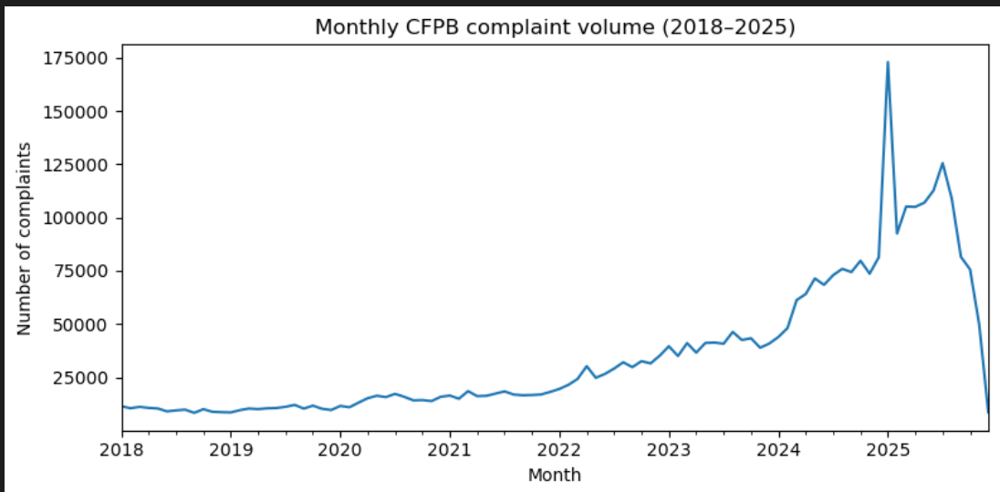
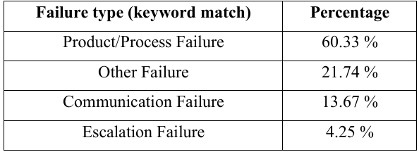
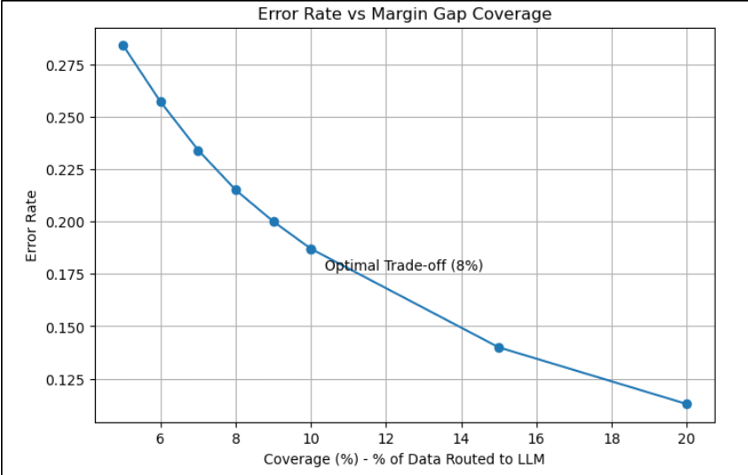
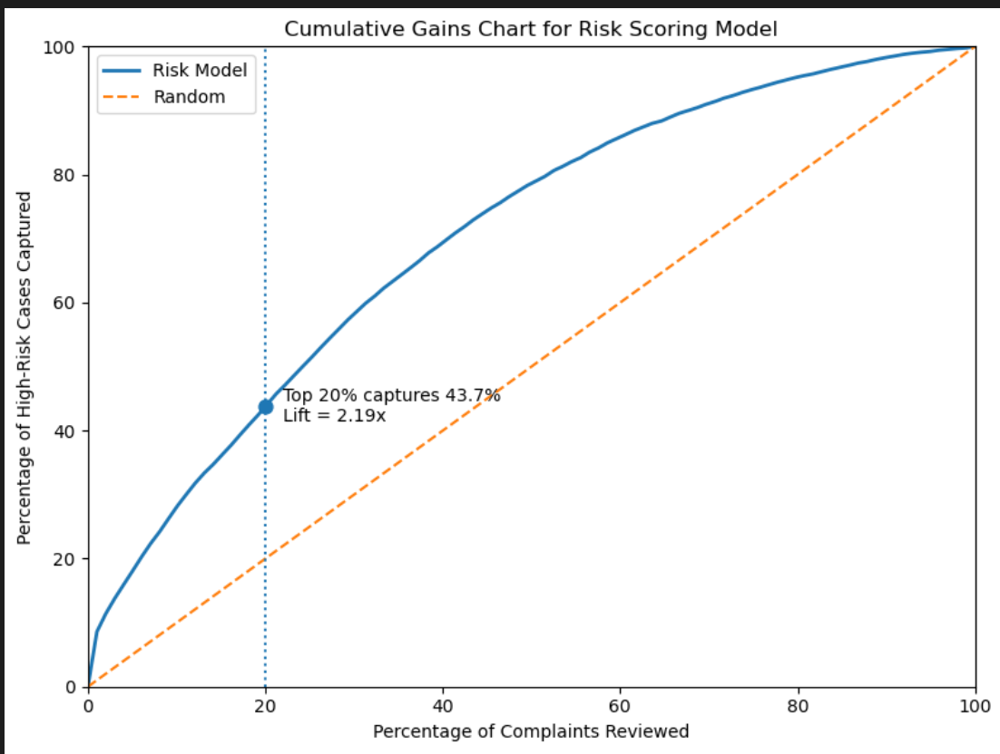
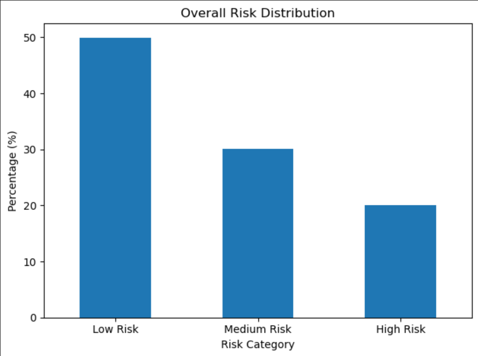

# cfpb-risk-analytics
AI-driven consumer complaint classification and risk scoring -1.9M CFPB records, hybrid ML+LLM pipeline, 2.19x lift in high-risk case detection

# CFPB Consumer Complaint Risk Analytics

> **Reducing compliance review workload by 50–60% using AI-driven complaint classification and risk scoring across 1.9 million financial service complaints.**

---

## 🏦 Business Problem

Financial institutions receive over 6.2 million consumer complaints per year — roughly 18,000 per day. Critical risk signals are buried inside unstructured complaint narratives, making it impossible for compliance teams to manually review everything in time.

**The cost of missing high-risk complaints:** regulatory penalties, reputational damage, and delayed customer resolution.

---

## Business Impact

| Metric | Result |
|--------|--------|
| Manual review workload reduction | 50–60% |
| High-risk cases captured in top 20% reviewed | 43.7% |
| Lift over random selection | 2.19x |
| Model classification accuracy | 97.16% |
| Macro F1-score (across all failure types) | 0.95 |
| Dataset size | 1.9 million complaints (2018–2025) |
| Estimated daily processing capacity | ~18,000 complaints/day |

---

## My Approach

1. **Defined 4 failure categories** from complaint narratives using keyword-based weak supervision — Product/Process Failure, Communication Failure, Escalation Failure, Other Failure
2. **Built a text classification pipeline** — TF-IDF vectorization + Linear SVM with balanced class weights
3. **Added selective LLM routing** — complaints in the lowest 8th percentile of model confidence were routed to GPT for secondary classification, keeping LLM cost under $1/day
4. **Designed a risk scoring model** — logistic regression assigning each complaint a continuous risk probability based on model uncertainty, narrative length, and failure severity
5. **Validated with gains analysis** — decile lift charts confirming the model concentrates high-risk cases at the top of the ranked list

---

## Key Findings

- **Credit Reporting drives 70% of complaints** — complaint risk is product-specific, not uniform across the organization
- **Complaint patterns are structurally stable over time** (Cramér's V = 0.16 for period × issue) — temporal features add minimal predictive value
- **Model uncertainty is the strongest risk signal** — the top decile achieves 2.81x lift, confirming that low-confidence predictions concentrate the highest-risk cases
- **Hybrid ML + LLM outperforms either alone** — LLM augmentation improved accuracy from 6% to 92% in the most ambiguous 8% of cases

---

## 🛠 Tools & Methods

| Category | Details |
|----------|---------|
| Language | Python |
| ML Library | scikit-learn |
| Text Features | TF-IDF (unigrams + bigrams, 30K features) |
| Models | Linear SVM, Logistic Regression, Multinomial Naive Bayes |
| LLM | OpenAI GPT (zero-shot classification) |
| Evaluation | Macro F1, Cumulative Gains Chart, Decile Lift |
| Data Source | [CFPB Consumer Complaint Database](https://www.consumerfinance.gov/data-research/consumer-complaints/) |

---

## AI Usage Disclosure

- **AI-assisted:** LLM (GPT) used for secondary classification of low-confidence cases only (8% of total complaints)
- **Human analytical judgment:** failure category definitions, weak supervision label design, model selection rationale, threshold decisions, business interpretation of findings, deployment strategy
- **Not AI-generated:** the risk scoring framework design, feature engineering logic, and evaluation methodology

---

## Results

**Risk Tier Distribution**
- High Risk (top 20%): captures 43.7% of all truly high-risk complaints
- Medium Risk (next 30%): moderate concentration of risk cases
- Low Risk (bottom 50%): minimal high-risk cases — safe to deprioritize for manual review

**Model Comparison**
| Model | Accuracy | Macro F1 |
|-------|----------|----------|
| Linear SVM — balanced weights ✅ | 97.16% | 0.95 |
| Logistic Regression | 95.23% | 0.92 |
| SMOTE + Linear SVM | 89.70% | 0.86 |
| Multinomial Naive Bayes | 70.00% | 0.56 |

---

## Business Recommendations

1. Deploy the hybrid pipeline as an API integrated into existing complaint management systems (e.g., Salesforce Service Cloud)
2. Embed risk scores into complaint triage workflows to auto-prioritize incoming cases
3. Build dedicated high-risk review queues for Escalation and Communication failures
4. Monitor Credit Reporting and Loans & Lending product categories most closely — highest complaint volume and risk concentration

---

## Limitations

- Risk scoring target is constructed from model uncertainty, not verified business outcome labels
- Keyword-based labels are a weak supervision proxy — not expert-annotated ground truth
- LLM routing tested at 8% threshold; production threshold may need adjustment based on actual complaint volume
- Model should be retrained on a rolling 12–18 month window to account for data drift

---

## 📈 Visual Walkthrough

**1. Complaint Volume Trend (2018–2025)**

**2. Failure Type Classification — Keyword Matching**

**3. Margin Gap Threshold — Optimal LLM Routing Decision Point**

**4. Cumulative Gains Chart — Risk Model Performance**

**5. Overall Risk Distribution — High / Medium / Low Tiers**

## 📁 Repository Structure
cfpb-risk-analytics/
├── README.md
├── notebooks/          ← Python analysis notebook
├── sql/                ← Analytical SQL queries
├── images/             ← Charts and visualizations
└── docs/               ← Executive summary

---

*Domain: Financial Services · Compliance · Risk Analytics*
*Tools: Python · scikit-learn · NLP · LLM · Logistic Regression*
